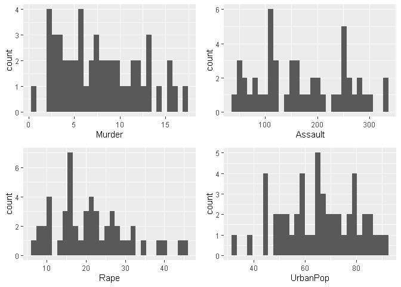
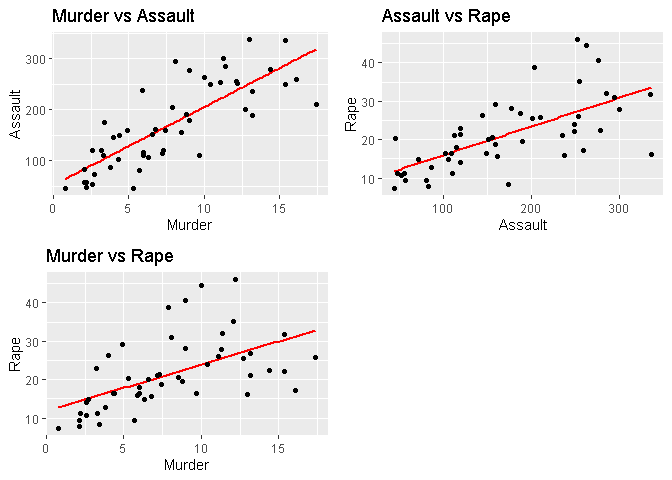
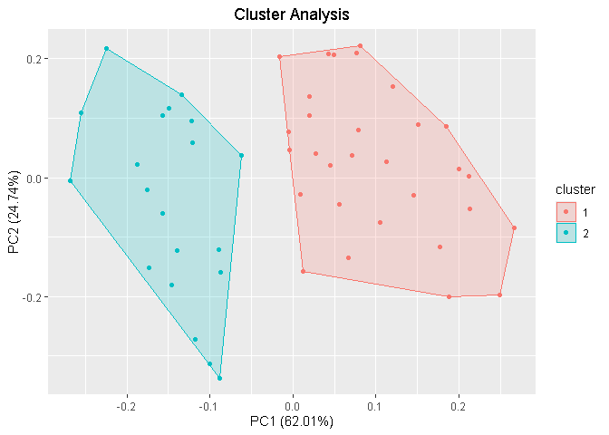
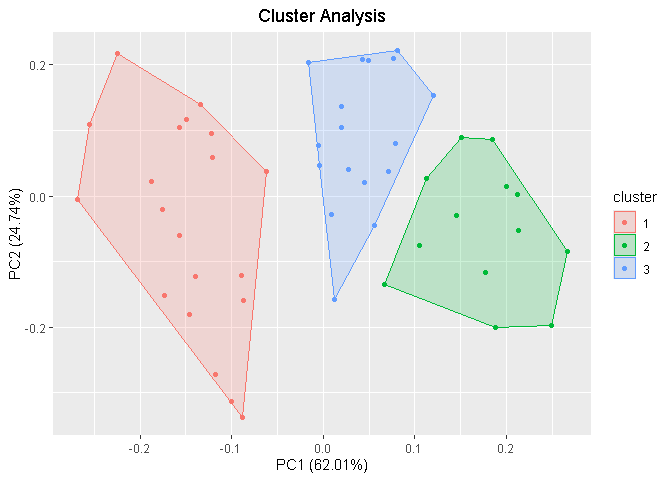
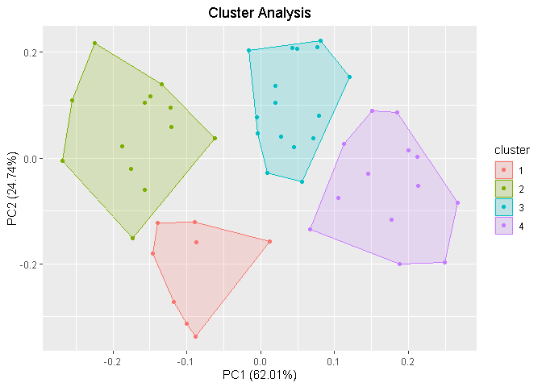
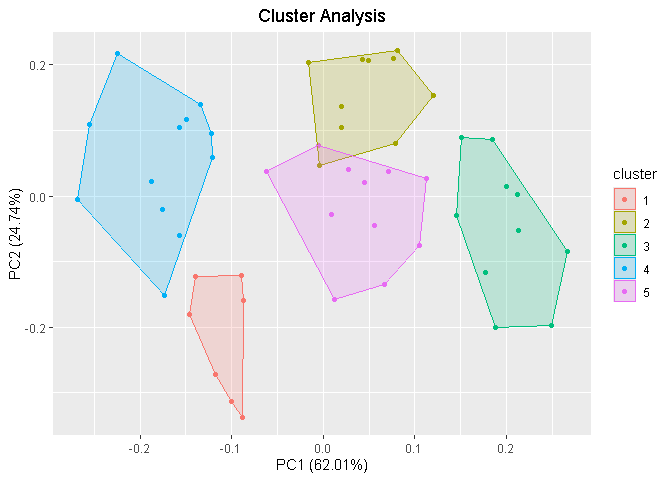
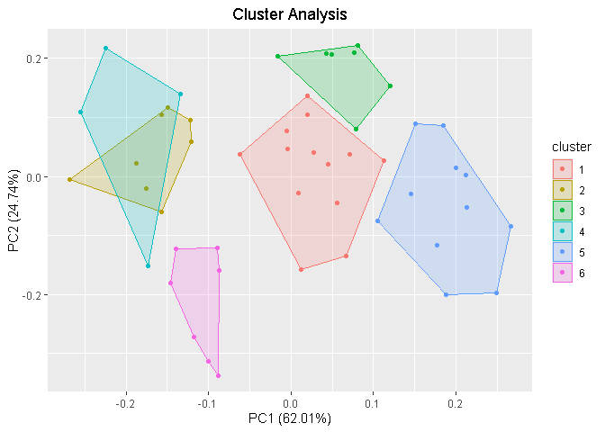

USA Crime Dynamics
================
Fausto Lira
2024-02-13

## Introduction

The purpose of this study is to apply K-Means clustering to classify
regions of the United States based on levels of violent crime, including
murder, assault, and rape. By applying this technique to crime data, we
aim to identify distinct groups of states with similar crime intensity.

Although each type of crime impacts society differently, for the
educational purpose of this project, we will determine the level of
violence based on the average across the different types of crime.

The
[USArrests](https://www.rdocumentation.org/packages/datasets/versions/3.6.2/topics/USArrests)
is a data set included in *datasets* package in R. It provides, for each
of the 50 US states, statistics about assault, murder, rape in arrests
per 100,000 residents, and the percentage of the population living in
urban areas in 1973.

Variables

`Murder` - Murder arrests (per 100,000)  
`Assault` - Assault arrests (per 100,000)  
`Rape` - Rape arrests (per 100,000)  
`UrbanPop` - Percent urban population

``` r
## Packages
library(dplyr)
library(ggplot2)
library(bruceR)
library(corrplot)
library(reshape2)
library(ggfortify)  ## autoplot() function
library(factoextra)
library(cluster)
library(cowplot)
```

### Load the data

``` r
db <- USArrests
```

``` r
head(db)
```

    ##            Murder Assault UrbanPop Rape
    ## Alabama      13.2     236       58 21.2
    ## Alaska       10.0     263       48 44.5
    ## Arizona       8.1     294       80 31.0
    ## Arkansas      8.8     190       50 19.5
    ## California    9.0     276       91 40.6
    ## Colorado      7.9     204       78 38.7

``` r
summary(db)
```

    ##      Murder          Assault         UrbanPop          Rape      
    ##  Min.   : 0.800   Min.   : 45.0   Min.   :32.00   Min.   : 7.30  
    ##  1st Qu.: 4.075   1st Qu.:109.0   1st Qu.:54.50   1st Qu.:15.07  
    ##  Median : 7.250   Median :159.0   Median :66.00   Median :20.10  
    ##  Mean   : 7.788   Mean   :170.8   Mean   :65.54   Mean   :21.23  
    ##  3rd Qu.:11.250   3rd Qu.:249.0   3rd Qu.:77.75   3rd Qu.:26.18  
    ##  Max.   :17.400   Max.   :337.0   Max.   :91.00   Max.   :46.00

``` r
glimpse(db)
```

    ## Rows: 50
    ## Columns: 4
    ## $ Murder   <dbl> 13.2, 10.0, 8.1, 8.8, 9.0, 7.9, 3.3, 5.9, 15.4, 17.4, 5.3, 2.…
    ## $ Assault  <int> 236, 263, 294, 190, 276, 204, 110, 238, 335, 211, 46, 120, 24…
    ## $ UrbanPop <int> 58, 48, 80, 50, 91, 78, 77, 72, 80, 60, 83, 54, 83, 65, 57, 6…
    ## $ Rape     <dbl> 21.2, 44.5, 31.0, 19.5, 40.6, 38.7, 11.1, 15.8, 31.9, 25.8, 2…

## Check Null Values and Duplicate Rows

``` r
# check null values
colSums(is.na(db))
```

    ##   Murder  Assault UrbanPop     Rape 
    ##        0        0        0        0

``` r
# check duplicates rows
sum(duplicated(db))
```

    ## [1] 0

## Univariate Analysis

``` r
# Charts
p1 <- ggplot(db, aes(x = Murder)) +
  geom_histogram()

p2 <- ggplot(db, aes(x = Assault)) +
  geom_histogram()

p3 <- ggplot(db, aes(x = Rape)) +
  geom_histogram()

p4 <- ggplot(db, aes(x = UrbanPop)) +
  geom_histogram()

plot_grid(p1, p2, p3, p4, ncol = 2, nrow = 2)
```

<!-- -->
\### Basic Statistics

#### Variable: Murder

``` r
Describe(db$Murder)
```

    ## Descriptive Statistics:
    ## ─────────────────────────────────────────────────────
    ##     N Mean   SD | Median  Min   Max Skewness Kurtosis
    ## ─────────────────────────────────────────────────────
    ##    50 7.79 4.36 |   7.25 0.80 17.40     0.37    -0.95
    ## ─────────────────────────────────────────────────────

#### Variable: Assault

``` r
Describe(db$Assault)
```

    ## Descriptive Statistics:
    ## ──────────────────────────────────────────────────────────
    ##     N   Mean    SD | Median   Min    Max Skewness Kurtosis
    ## ──────────────────────────────────────────────────────────
    ##    50 170.76 83.34 | 159.00 45.00 337.00     0.22    -1.15
    ## ──────────────────────────────────────────────────────────

#### Variable: Urban Population

``` r
Describe(db$UrbanPop)
```

    ## Descriptive Statistics:
    ## ────────────────────────────────────────────────────────
    ##     N  Mean    SD | Median   Min   Max Skewness Kurtosis
    ## ────────────────────────────────────────────────────────
    ##    50 65.54 14.47 |  66.00 32.00 91.00    -0.21    -0.87
    ## ────────────────────────────────────────────────────────

#### Variable: Rape

``` r
Describe(db$Rape)
```

    ## Descriptive Statistics:
    ## ──────────────────────────────────────────────────────
    ##     N  Mean   SD | Median  Min   Max Skewness Kurtosis
    ## ──────────────────────────────────────────────────────
    ##    50 21.23 9.37 |  20.10 7.30 46.00     0.75     0.08
    ## ──────────────────────────────────────────────────────

### Bivariate Analysis

Correlation Heat map

``` r
corr_mat <- round(cor(db, method = "pearson"),2)

# heatmap(corr_mat)

melted_corr_mat <- melt(corr_mat)

ggplot(data=melted_corr_mat, aes(x=Var1, y=Var2, fill=value)) +
  geom_tile() +
  scale_fill_gradientn(colors = c('red', 'white', 'blue'), limits = c(-1, 1)) +
  geom_text(aes(Var2, Var1, label = value), color = "black", size = 4)
```

<!-- -->
Let’s analyze the correlation between Murder vs Assault, Assault vs
Rape, and Murder vs Rape.

``` r
p1 <- ggplot(db, aes(x=Murder, y=Assault)) +
  geom_smooth(method = "lm", se = FALSE, color='red') +
  labs(title = "Murder vs Assault") +
  geom_point()

p2<- ggplot(db, aes(x=Assault, y=Rape)) +
  geom_smooth(method = "lm", se = FALSE, color='red') +
  labs(title = "Assault vs Rape") +
  geom_point()

p3 <- ggplot(db, aes(x=Murder, y=Rape)) +
  geom_smooth(method = "lm", se = FALSE, color='red') +
  labs(title = "Murder vs Rape") +
  geom_point()

plot_grid(p1, p2, p3, ncol = 2, nrow = 2)
```

<!-- -->
Although there is a significant correlation between murder and assault,
we will keep both since the dataset only contains four columns.

## Data Transformation

Scaling replaces all means with 0 and all standard deviations with 1.
This is useful for several reasons:

1.  K-means is sensible for outliers and scaling is a way to smooth out
    the problem.  
2.  It also helps the compassion between the variables.  
3.  It makes easier the interpretation of k-means (details below).

``` r
scaled_DB <- data.frame(scale(db))
```

### The convention for k-means used here is as follows

For each variable Murder, Assault, UrbanPop, and Rape let’s assume that:

If the value is 0, it indicates that the value is the average.

If the value belongs to \[-1, 0) it will be considered moderately low
(**ML**).  
If the value belongs to \[-2, 1) it will be considered very low
(**VL**).  
If the value is lesser than -2 it will be considered extremely low
(**EL**).

If the value belongs to (0, 1\] it will be considered moderately high
(**MH**).  
If the value belongs to (1, 2\] it will be considered very high
(**VH**).  
If the value is greater than 2 it will be considered extremely high
(**EH**).

For example, consider the row 10.

``` r
scaled_DB[10,]
```

    ##          Murder   Assault   UrbanPop      Rape
    ## Georgia 2.20686 0.4828549 -0.3827351 0.4877015

By the above convention, the murder rate is considered extremely high,
the assault rate is considered moderately high, the urban population is
considered moderately low, and the rape rate is considered moderately
high.

### Distributions After Scaling

``` r
p1 <- ggplot(scaled_DB, aes(x = Murder)) +
  geom_histogram()

p2 <- ggplot(scaled_DB, aes(x = Assault)) +
  geom_histogram()

p3 <- ggplot(scaled_DB, aes(x = Rape)) +
  geom_histogram()

p4 <- ggplot(scaled_DB, aes(x = UrbanPop)) +
  geom_histogram()

plot_grid(p1, p2, p3, p4, ncol = 2, nrow = 2)
```

<!-- -->

## Optimal Number of Clusters from the Elbow and Silhouette Methods

The elbow and silhouette methods can provide a good estimate of the
number of clusters, k. However, the final determination of the number of
clusters depends on the interpretation of the data and the specific
business problem.

Furthermore, visualizing the clusters through PCA helps evaluate the
clustering quality.

``` r
# Elbow Method
p1 <- fviz_nbclust(scaled_DB, kmeans, method = "wss", k.max = 10) +
  ggtitle("Elbow Method")
```

    ## Registered S3 methods overwritten by 'broom':
    ##   method            from  
    ##   tidy.glht         jtools
    ##   tidy.summary.glht jtools

``` r
# Average Silhouette Width
p2 <- fviz_nbclust(scaled_DB, kmeans, method = "silhouette", k.max = 10) +
  ggtitle("Average Silhouette Width")

# Arrange plots in a grid with increased vertical space
plot_grid(p1, p2, ncol = 1, nrow=2)
```

<!-- -->

- By the Elbow Method the number of 6 could be the optimized number of
  clusters.

- By the Silhouette Method the number of 2 is the optimized number of
  clusters.

## K-Means with k = 2, 3, 4, 5, 6

Next we apply the k-mean clustering model for k from 2 to 6.

One can observe that the first two components explain approximately 89%
of the entire dataset, as shown in the charts below.

### k=2

``` r
kmeans2 <- kmeans(scaled_DB, centers = 2, nstart = 10)
kmeans2
```

    ## K-means clustering with 2 clusters of sizes 30, 20
    ## 
    ## Cluster means:
    ##      Murder    Assault   UrbanPop       Rape
    ## 1 -0.669956 -0.6758849 -0.1317235 -0.5646433
    ## 2  1.004934  1.0138274  0.1975853  0.8469650
    ## 
    ## Clustering vector:
    ##        Alabama         Alaska        Arizona       Arkansas     California 
    ##              2              2              2              1              2 
    ##       Colorado    Connecticut       Delaware        Florida        Georgia 
    ##              2              1              1              2              2 
    ##         Hawaii          Idaho       Illinois        Indiana           Iowa 
    ##              1              1              2              1              1 
    ##         Kansas       Kentucky      Louisiana          Maine       Maryland 
    ##              1              1              2              1              2 
    ##  Massachusetts       Michigan      Minnesota    Mississippi       Missouri 
    ##              1              2              1              2              2 
    ##        Montana       Nebraska         Nevada  New Hampshire     New Jersey 
    ##              1              1              2              1              1 
    ##     New Mexico       New York North Carolina   North Dakota           Ohio 
    ##              2              2              2              1              1 
    ##       Oklahoma         Oregon   Pennsylvania   Rhode Island South Carolina 
    ##              1              1              1              1              2 
    ##   South Dakota      Tennessee          Texas           Utah        Vermont 
    ##              1              2              2              1              1 
    ##       Virginia     Washington  West Virginia      Wisconsin        Wyoming 
    ##              1              1              1              1              1 
    ## 
    ## Within cluster sum of squares by cluster:
    ## [1] 56.11445 46.74796
    ##  (between_SS / total_SS =  47.5 %)
    ## 
    ## Available components:
    ## 
    ## [1] "cluster"      "centers"      "totss"        "withinss"     "tot.withinss"
    ## [6] "betweenss"    "size"         "iter"         "ifault"

``` r
autoplot(kmeans2, scaled_DB, frame = TRUE) + ggtitle('Cluster Analysis') +
  theme(plot.title = element_text(hjust = 0.5))
```

<!-- -->
\#### Interpretation

There are two clusters 1 and 2 which have the centers below.

| Center | Murder | Assault | Rape  | Average | UrbanPop |
|--------|--------|---------|-------|---------|----------|
| 1      | -0.67  | -0.68   | -0.56 | -0.64   | -0.13    |
| 2      | 1.00   | 1.01    | 0.85  | 0.95    | 0.20     |

Analyzing the averages one can conclude that:

- The Cluster 1 has a considered moderately low criminality.  
- The Cluster 2 can be considered moderately high criminality.

### K=3

``` r
kmeans3 <- kmeans(scaled_DB, centers = 3, nstart = 10)
kmeans3
```

    ## K-means clustering with 3 clusters of sizes 20, 13, 17
    ## 
    ## Cluster means:
    ##       Murder    Assault   UrbanPop       Rape
    ## 1  1.0049340  1.0138274  0.1975853  0.8469650
    ## 2 -0.9615407 -1.1066010 -0.9301069 -0.9667633
    ## 3 -0.4469795 -0.3465138  0.4788049 -0.2571398
    ## 
    ## Clustering vector:
    ##        Alabama         Alaska        Arizona       Arkansas     California 
    ##              1              1              1              3              1 
    ##       Colorado    Connecticut       Delaware        Florida        Georgia 
    ##              1              3              3              1              1 
    ##         Hawaii          Idaho       Illinois        Indiana           Iowa 
    ##              3              2              1              3              2 
    ##         Kansas       Kentucky      Louisiana          Maine       Maryland 
    ##              3              2              1              2              1 
    ##  Massachusetts       Michigan      Minnesota    Mississippi       Missouri 
    ##              3              1              2              1              1 
    ##        Montana       Nebraska         Nevada  New Hampshire     New Jersey 
    ##              2              2              1              2              3 
    ##     New Mexico       New York North Carolina   North Dakota           Ohio 
    ##              1              1              1              2              3 
    ##       Oklahoma         Oregon   Pennsylvania   Rhode Island South Carolina 
    ##              3              3              3              3              1 
    ##   South Dakota      Tennessee          Texas           Utah        Vermont 
    ##              2              1              1              3              2 
    ##       Virginia     Washington  West Virginia      Wisconsin        Wyoming 
    ##              3              3              2              2              3 
    ## 
    ## Within cluster sum of squares by cluster:
    ## [1] 46.74796 11.95246 19.62285
    ##  (between_SS / total_SS =  60.0 %)
    ## 
    ## Available components:
    ## 
    ## [1] "cluster"      "centers"      "totss"        "withinss"     "tot.withinss"
    ## [6] "betweenss"    "size"         "iter"         "ifault"

``` r
autoplot(kmeans3, scaled_DB, frame = TRUE) + ggtitle('Cluster Analysis') +
  theme(plot.title = element_text(hjust = 0.5))
```

<!-- -->

#### Interpretation

There are two clusters 1, 2, and 3 which have the centers below.

| Center | Murder | Assault | Rape  | Average | UrbanPop |
|--------|--------|---------|-------|---------|----------|
| 1      | 1.00   | 1.01    | 0.85  | 0.96    | 0.20     |
| 2      | -0.96  | -1.11   | -0.97 | -1.01   | -0.93    |
| 3      | -0.45  | -0.35   | -0.26 | -0.35   | 0.48     |

Analyzing the averages one can conclude that:

- The Cluster 1 has a considered moderately high criminality.  
- The Cluster 2 can be considered very low criminality.
- The Cluster 3 can be considered moderate low criminality.

### K=4

``` r
kmeans4 <- kmeans(scaled_DB, centers = 4, nstart = 10)
kmeans4
```

    ## K-means clustering with 4 clusters of sizes 8, 13, 16, 13
    ## 
    ## Cluster means:
    ##       Murder    Assault   UrbanPop        Rape
    ## 1  1.4118898  0.8743346 -0.8145211  0.01927104
    ## 2  0.6950701  1.0394414  0.7226370  1.27693964
    ## 3 -0.4894375 -0.3826001  0.5758298 -0.26165379
    ## 4 -0.9615407 -1.1066010 -0.9301069 -0.96676331
    ## 
    ## Clustering vector:
    ##        Alabama         Alaska        Arizona       Arkansas     California 
    ##              1              2              2              1              2 
    ##       Colorado    Connecticut       Delaware        Florida        Georgia 
    ##              2              3              3              2              1 
    ##         Hawaii          Idaho       Illinois        Indiana           Iowa 
    ##              3              4              2              3              4 
    ##         Kansas       Kentucky      Louisiana          Maine       Maryland 
    ##              3              4              1              4              2 
    ##  Massachusetts       Michigan      Minnesota    Mississippi       Missouri 
    ##              3              2              4              1              2 
    ##        Montana       Nebraska         Nevada  New Hampshire     New Jersey 
    ##              4              4              2              4              3 
    ##     New Mexico       New York North Carolina   North Dakota           Ohio 
    ##              2              2              1              4              3 
    ##       Oklahoma         Oregon   Pennsylvania   Rhode Island South Carolina 
    ##              3              3              3              3              1 
    ##   South Dakota      Tennessee          Texas           Utah        Vermont 
    ##              4              1              2              3              4 
    ##       Virginia     Washington  West Virginia      Wisconsin        Wyoming 
    ##              3              3              4              4              3 
    ## 
    ## Within cluster sum of squares by cluster:
    ## [1]  8.316061 19.922437 16.212213 11.952463
    ##  (between_SS / total_SS =  71.2 %)
    ## 
    ## Available components:
    ## 
    ## [1] "cluster"      "centers"      "totss"        "withinss"     "tot.withinss"
    ## [6] "betweenss"    "size"         "iter"         "ifault"

``` r
autoplot(kmeans4, scaled_DB, frame = TRUE)+ ggtitle('Cluster Analysis') +
  theme(plot.title = element_text(hjust = 0.5))
```

<!-- -->

#### Interpretation

There are two clusters 1, 2, 3, and 4 which have the centers below.

| Center | Murder | Assault | Rape  | Average | UrbanPop |
|--------|--------|---------|-------|---------|----------|
| 1      | 1.41   | 0.87    | 0.02  | 0.77    | -0.81    |
| 2      | 0.70   | 1.04    | 1.28  | 1.01    | 0.72     |
| 3      | -0.49  | -0.38   | -0.26 | -0.38   | 0.58     |
| 4      | -0.96  | -1.11   | -0.97 | -1.01   | -0.93    |

Analyzing the averages one can conclude that:

- The Cluster 1 has a considered moderately high criminality.  
- The Cluster 2 has a considered very high criminality.  
- The Cluster 3 can be considered moderately low criminality.
- The Cluster 4 can be considered very low criminality.

### K=5

``` r
kmeans5 <- kmeans(scaled_DB, centers = 5, nstart = 10)
kmeans5
```

    ## K-means clustering with 5 clusters of sizes 7, 10, 10, 12, 11
    ## 
    ## Cluster means:
    ##       Murder    Assault   UrbanPop        Rape
    ## 1  1.5803956  0.9662584 -0.7775109  0.04844071
    ## 2 -0.6286291 -0.4086988  0.9506200 -0.38883734
    ## 3 -1.1727674 -1.2078573 -1.0045069 -1.10202608
    ## 4  0.7298036  1.1188219  0.7571799  1.32135653
    ## 5 -0.1642225 -0.3658283 -0.2822467 -0.11697538
    ## 
    ## Clustering vector:
    ##        Alabama         Alaska        Arizona       Arkansas     California 
    ##              1              4              4              5              4 
    ##       Colorado    Connecticut       Delaware        Florida        Georgia 
    ##              4              2              2              4              1 
    ##         Hawaii          Idaho       Illinois        Indiana           Iowa 
    ##              2              3              4              5              3 
    ##         Kansas       Kentucky      Louisiana          Maine       Maryland 
    ##              5              5              1              3              4 
    ##  Massachusetts       Michigan      Minnesota    Mississippi       Missouri 
    ##              2              4              3              1              5 
    ##        Montana       Nebraska         Nevada  New Hampshire     New Jersey 
    ##              5              5              4              3              2 
    ##     New Mexico       New York North Carolina   North Dakota           Ohio 
    ##              4              4              1              3              2 
    ##       Oklahoma         Oregon   Pennsylvania   Rhode Island South Carolina 
    ##              5              5              2              2              1 
    ##   South Dakota      Tennessee          Texas           Utah        Vermont 
    ##              3              1              4              2              3 
    ##       Virginia     Washington  West Virginia      Wisconsin        Wyoming 
    ##              5              2              3              3              5 
    ## 
    ## Within cluster sum of squares by cluster:
    ## [1]  6.128432  9.326266  7.443899 18.257332  7.788275
    ##  (between_SS / total_SS =  75.0 %)
    ## 
    ## Available components:
    ## 
    ## [1] "cluster"      "centers"      "totss"        "withinss"     "tot.withinss"
    ## [6] "betweenss"    "size"         "iter"         "ifault"

``` r
autoplot(kmeans5, scaled_DB, frame = TRUE)+ ggtitle('Cluster Analysis') +
  theme(plot.title = element_text(hjust = 0.5))
```

<!-- -->

The clusters are overlapping.

### K=6

``` r
kmeans6 <- kmeans(scaled_DB, centers = 6, nstart = 10)
kmeans6
```

    ## K-means clustering with 6 clusters of sizes 13, 8, 7, 4, 11, 7
    ## 
    ## Cluster means:
    ##       Murder    Assault    UrbanPop        Rape
    ## 1 -0.2162425 -0.2611064 -0.04793489 -0.06172647
    ## 2  0.8666035  1.2103171  0.82626566  0.84936722
    ## 3 -0.6958674 -0.5679476  1.12728218 -0.55096728
    ## 4  0.4562038  0.9358314  0.61900839  2.26533514
    ## 5 -1.1034717 -1.1654231 -0.99194587 -1.04874074
    ## 6  1.5803956  0.9662584 -0.77751086  0.04844071
    ## 
    ## Clustering vector:
    ##        Alabama         Alaska        Arizona       Arkansas     California 
    ##              6              4              2              1              4 
    ##       Colorado    Connecticut       Delaware        Florida        Georgia 
    ##              4              3              1              2              6 
    ##         Hawaii          Idaho       Illinois        Indiana           Iowa 
    ##              3              5              2              1              5 
    ##         Kansas       Kentucky      Louisiana          Maine       Maryland 
    ##              1              1              6              5              2 
    ##  Massachusetts       Michigan      Minnesota    Mississippi       Missouri 
    ##              3              2              5              6              1 
    ##        Montana       Nebraska         Nevada  New Hampshire     New Jersey 
    ##              5              1              4              5              3 
    ##     New Mexico       New York North Carolina   North Dakota           Ohio 
    ##              2              2              6              5              1 
    ##       Oklahoma         Oregon   Pennsylvania   Rhode Island South Carolina 
    ##              1              1              3              3              6 
    ##   South Dakota      Tennessee          Texas           Utah        Vermont 
    ##              5              6              2              3              5 
    ##       Virginia     Washington  West Virginia      Wisconsin        Wyoming 
    ##              1              1              5              5              1 
    ## 
    ## Within cluster sum of squares by cluster:
    ## [1] 10.860162  5.888384  5.244931  6.257771  8.499862  6.128432
    ##  (between_SS / total_SS =  78.1 %)
    ## 
    ## Available components:
    ## 
    ## [1] "cluster"      "centers"      "totss"        "withinss"     "tot.withinss"
    ## [6] "betweenss"    "size"         "iter"         "ifault"

``` r
autoplot(kmeans6, scaled_DB, frame = TRUE) + ggtitle('Cluster Analysis') +
  theme(plot.title = element_text(hjust = 0.5))
```

<!-- -->

Overlapping again.

K=4 represents a good choice for k-means since it divides the dataset
into 4 disjoint subsets. Therefore, applying the k-means algorithm with
k=4 provides the optimal clustering of American regions with respect to
violent crimes.
